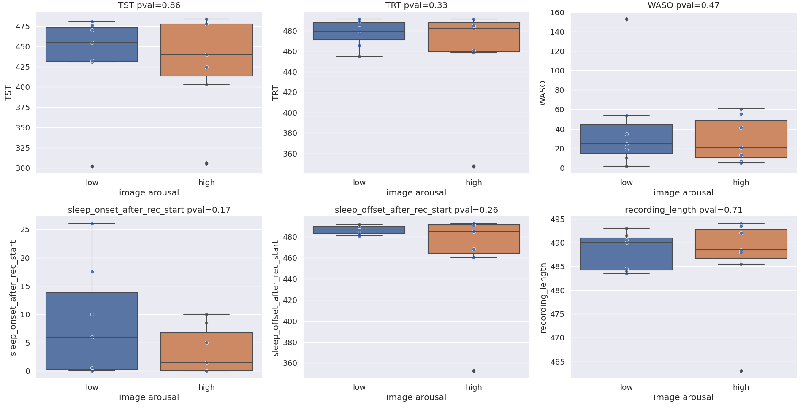

# Emo React - Analysis

- [1. Behavioural Analysis](#1-behavioural-analysis)
  * [1.1 Memory Performance old/new](#11-memory-performance-old-new)
  * [1.2 Memory performance quadrant](#12-memory-performance-quadrant)
  * [1.3 Subjective ratings vs OASIS ratings](#13-subjective-ratings-vs-oasis-ratings)
  * [1.4  Subjective arousal ratings for different nights](#14--subjective-arousal-ratings-for-different-nights)
  * [1.5 Subjective valence ratings for different nights](#15-subjective-valence-ratings-for-different-nights)
  * [1.6 Image category effect on ratings](#16-image-category-effect-on-ratings)
- [2. Sleep Stage Analysis](#2-sleep-stage-analysis)
  * [2.1 Absolut Values](#21-absolut-values)
  * [2.2 Sleep Cycle Markers](#22-sleep-cycle-markers)
  * [2.3 Hypnogram summary for both conditions](#23-hypnogram-summary-for-both-conditions)
- [3. EEG Power analysis](#3-eeg-power-analysis)
  * [3.1 Power analysis per sleep stage](#31-power-analysis-per-sleep-stage)
  * [3.2 Power analysis per region](#32-power-analysis-per-region)
- [4. Spindle analysis](#4-spindle-analysis)
  * [4.1 Spindle results](#41-spindle-results)
## 1. Behavioural Analysis

### 1.1 Memory Performance old/new

**Description**: For all participants, four tests have been made, for each night type (high/low arousal), one test was performed before sleep and one after sleep. For analysing test performance there are different metrics that can be calculates. For a binary classification, such as `old` or `new`, often the `precision` and the `recall` are calculated. `recall` (also called `sensitivity`) specifies what fraction of relevant items of the test were recalled (i.e. percentage of old pictures that were selected correctly by the participant. `precision` specifies how many of the selected items were actually correctly selected (i.e. percentage of pictures selected as `old` that were actually `old`). These two scores can be combined via the so called `f1-score`, a measure that balances both measures by doing a weighted average of them. A simple accuracy score would not be advised, as the old/new classes are not balanced (i.e., 48 new images, 96 new images).

**Results**: Using a relative ttest, no significant increase in learning could be found, neither in the `high` nor `low` condition (p=0.11, p=0.54).


### 1.2 Memory performance quadrant

**Description**: For each image that the participant classified as `old`, they were asked to indicate in which of four quadrant the image originally appeared. As the distribution of  quadrants is uniform, i.e., each quadrant was assigned exactly 25% of the times, an accuracy score is accurate measure for this task. For this analysis, only images that were correctly identified as `old` by the participant were included.

**Results**: Using a relative ttest, no significant increase in learning could be found from before and after sleep, neither in the `high` nor `low` condition (p=0.11, p=0.54). However, the variance in learning performance was much higher in the `high` condition. Sorry, I don't know off the top of my hat how one would statistically test that, probably with a two-way ANOVA, but I've never done that, so for now I'd have to leave that out. However, I don't expect it to be significant, there's just one outlier participant with lower quadrant performance.


### 1.3 Subjective ratings vs OASIS ratings

**Description**: The participants were asked to rate the images according to their subjective arousal and valence reactions. 

**Results**: Using a Pearson correlation we can show that the subjective ratings show a very high correlation with the mean OASIS ratings of 100 participants (p<0.000001 for both Valence and Arousal).


### 1.4  Subjective arousal ratings for different nights

**Description**: Nights had either low or high arousing images. This should reflect in the subjective ratings of the images of the two nights.

**Results**: There was a significant difference between the high and low arousal nights in subjective arousal rating, shown by a ttest statistic (p<0.0001). This means the experimental manipulation worked.


### 1.5 Subjective valence ratings for different nights

**Description**: Nights had either low or high arousing images. No manipulation to the valence was done, so valence should be rated equally in both nights.

**Results**: No significant difference was detectable for the subjective valence ratings. (ttest, p=0.14). This means the experimental manipulation worked.


### 1.6 Image category effect on ratings

**Description**: The images were stemming from 4 different categories: Persons, Scenes, Objects and Animals. The category might have an effect on the valence and arousal ratings, which might bias learning.

**Results**: There is a statistically highly significant effect of the image category on the ratings (p<0.000001) as determined by a one-way ANOVA. In future studies close attention should be paid that image categories are distributed equally to remove bias by uneven distribution.


## 2. Sleep Stage Analysis

### 2.1 Absolut Values

**Description**: Sleep stages can be calculated in absolute values, that means in minutes that people spent in a certain sleep stage. Other markers include TST (total sleep time, time spend in all stages other than wake), TRT (total recording time, time from first sleep onset to sleep offest), WASO (wake after sleep onset, time spent awake inbetween TRT, basically TRT-TST).

**Result**: No significant difference between the two conditions low/high could be found in these absolute sleep markers.



### 2.2 Sleep Cycle Markers

**Description**: Sleep stages can be analysed either as

- absolute time spent in certain sleep stage, 
- percentage of all sleep stages spent in specific stage
- how long it took to reach a certain sleep stage (latency)

**Results**: No significant difference could be detected in any of these measures. S1 latency was borderline significant, but this is generally a meaningless marker, as it is the first sleep stage anyway. What we see however is that the REM latency is very low for many participants. This is due to USleep, the automatic sleep staging algorithm that we use assigned REM quite often during the phase of falling asleep. This is a mistake and should be paid closer attention to in further studies


### 2.3 Hypnogram summary for both conditions

**Description**: By summarizing the hypnograms we can see how long each participant spent in which sleep stage. This is mainly useful for visualization.

**Result**: We see that REM is quite prominent at the beginning of the recording. We would not expect that and I strongly believe this is due to a mistake of the sleep scoring algorithm USleep that we use. Sleep onset REM (SOREM) is usually only happening in Narcolepsia, and not common in health, rested participants.


## 3. EEG Power analysis

EEG power of certain brain bands can give insight into cognitive processing. Therefore, in sleep research power bands for common brain bands are calculated for each sleep stage. 

### 3.1 Power analysis per sleep stage

**Description**: Sleep EEGs were taken and subdivided into blocks of 4 seconds. Then for each block of 4 seconds, a Fourier transformation was performed. Then the 4 second blocks were split up according to their sleep stage and again averaged for each electrode. This analysis was performed with the help of the python package [YASA](). All power values were normalized so that they add up to 1. Note: Gamma band is probably not accurately measured, as this brain band overlaps with the cutoff-frequency of our low pass filter. Therefore it has been excluded in the analysis. Frequency bands are defined as follows.

```
Delta: 0.5-4 Hz
Theta: 4-8 Hz
Alpha: 8-12 Hz
Sigma: 12-16 Hz
Beta: 16-30 Hz
```

**Results**: The data was split up into the two conditions, then into the sleep stages, and finally into the different brain bands. Relative ttests were computed, comparing all electrode power values per sleep stage per band for the two conditions. There was significant increase in Alpha power during both NREM sleep stages in the high condition. Additionally, Sigma power was increased in REM and Beta power was increased in S2 It should be noted that the artefact detection was not very thorough, so there might be lots of artefacts in the data that bias the analysis. Power analysis is especially susceptible to artefacts in the EEG.


### 3.2 Power analysis per region

**Description**: In the above analysis, all regions were combined into the same analysis.  However, analysis can also be performed per brain region to see if certain regions show more difference than others. For this analysis the same procedure as above is used, but the values are not normalized to sum to one, instead their total sum across all brain bands is taken (total band power). F=Frontal, T=Temporal, C=Central, P=Parietal, O=Occipital. For each participant, values were averaged by region and sleep stage and condition. That means the analysis contained 5x2 values for each participant for each sleep stage

**Results**: No significant difference in total power of the EEG for different sleep stages for different regions as determined by a relative ttest. This analysis could be further split up into different bands


## 4. Spindle analysis

Sleep spindles are important markers for sleep research. There are different methods to automatically detect spindles. In these analysis I'm again using the package YASA, which implements this method of spindle detection that is most closely to a human scorer (however, some also argue that it would be better not to approximate a human, as they also make mistakes):  [A sleep spindle detection algorithm that emulates human expert spindle scoring,](https://linkinghub.elsevier.com/retrieve/pii/S0165027018302504)

### 4.1 Spindle results

**Description**: For the spindle analysis I let YASA search for spindles in all channels surrounding `Pz`, i.e.`['Pz', 'CPz', 'P1', 'P2', 'POz']`. This is done to increase robustness and decrease errors due to artefacts in one of the channels. Spindles were only counted if they were detected in at least two different channels. The following markers have been used: 


**Results**: No significant difference could be detected as determined by a relative ttest. The results for the density are extremely high, I'm not sure they are correct, a density of 15 events/minute is highly implausible. This is probably due to artefacts. 


Example of the average spindle for PN10


Example of a detected spindle of PN10

