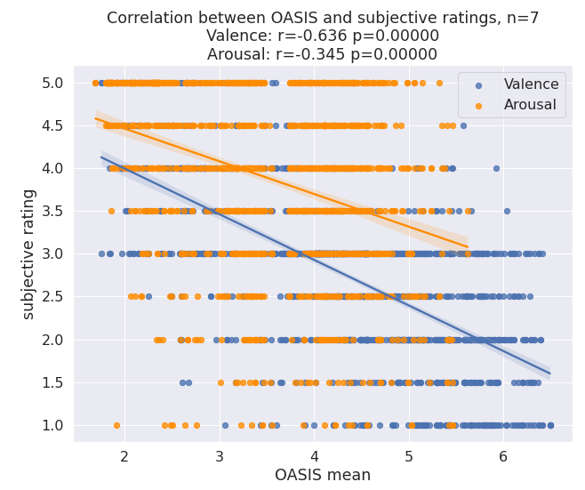

## Emo React - Analysis

[1. Behavioural Analysis](#1-behavioural-analysis)

* + [1.1 Memory Performance old/new](#11-memory-performance-old-new)
  + [1.2 Memory performance quadrant](#12-memory-performance-quadrant)
  + [1.3 Subjective ratings vs OASIS ratings](#13-subjective-ratings-vs-oasis-ratings)
  + [1.4 Subjective arousal ratings for different nights](#14-subjective-arousal-ratings-for-different-nights)
  + [1.5 Subjective valence ratings for different nights](#15-subjective-valence-ratings-for-different-nights)
  + [1.6 Image category effect on ratings](#16-image-category-effect-on-ratings)

### 1. Behavioural Analysis

#### 1.1 Memory Performance old/new

**Description**: For all participants, four tests have been made, for each night type (high/low arousal), one test was performed before sleep and one after sleep. For analysing test performance there are different metrics that can be calculates. For a binary classification, such as `old` or `new`, often the `precision` and the `recall` are calculated. `recall` (also called `sensitivity`) specifies what fraction of relevant items of the test were recalled (i.e. percentage of old pictures that were selected correctly by the participant. `precision` specifies how many of the selected items were actually correctly selected (i.e. percentage of pictures selected as `old` that were actually `old`). These two scores can be combined via the so called `f1-score`, a measure that balances both measures by doing a weighted average of them. A simple accuracy score would not be advised, as the old/new classes are not balanced (i.e., 48 new images, 96 new images).

**Results**: Using a relative ttest, no significant increase in learning could be found, neither in the `high` nor `low` condition (p=0.11, p=0.54).

#### 1.2 Memory performance quadrant

**Description**: For each image that the participant classified as `old`, they were asked to indicate in which of four quadrant the image originally appeared. As the distribution of  quadrants is uniform, i.e., each quadrant was assigned exactly 25% of the times, an accuracy score is accurate measure for this task. For this analysis, only images that were correctly identified as `old` by the participant were included.

**Results**: Using a relative ttest, no significant increase in learning could be found from before and after sleep, neither in the `high` nor `low` condition (p=0.11, p=0.54). However, the variance in learning performance was much higher in the `high` condition, sorry, I don't know off the top of my hat how one would statistically test that.

#### 1.3 Subjective ratings vs OASIS ratings

**Description**: The participants were asked to rate the images according to their subjective arousal and valence reactions. 

**Results**: Using a Pearson correlation we can show that the subjective ratings show a very high correlation with the mean OASIS ratings of 100 participants (p<0.000001 for both Valence and Arousal).

#### 1.4  Subjective arousal ratings for different nights

**Description**: Nights had either low or high arousing images. This should reflect in the subjective ratings of the images of the two nights.

**Results**: There was a significant difference between the high and low arousal nights in subjective arousal rating, shown by a ttest statistic (p<0.0001). This means the experimental manipulation worked.

#### 1.5 Subjective valence ratings for different nights

**Description**: Nights had either low or high arousing images. No manipulation to the valence was done, so valence should be rated equally in both nights.

**Results**: No significant difference was detectable for the subjective valence ratings. (ttest, p=0.14). This means the experimental manipulation worked.

#### 1.6 Image category effect on ratings

**Description**: The images were stemming from 4 different categories: Persons, Scenes, Objects and Animals. The category might have an effect on the valence and arousal ratings, which might bias learning.

**Results**: There is a statistically highly significant effect of the image category on the ratings (p<0.000001) as determined by a one-way ANOVA. In future studies close attention should be paid that image categories are distributed equally to remove bias by uneven distribution.

